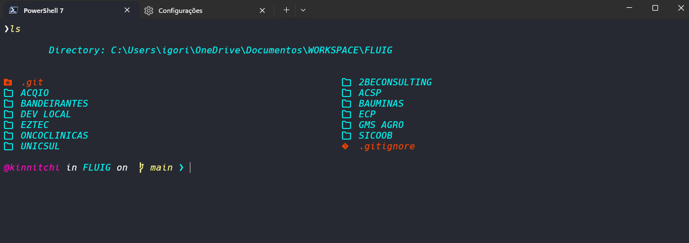
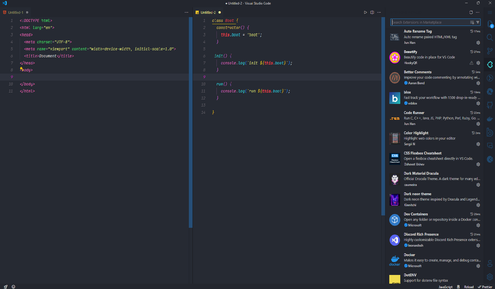

# Workspace settings

> The project focuses on my personal environment configurations. The aim is to establish a standardized setup that optimizes my productivity and efficiency across various tasks. This involves setting up development tools, and organizing my workspace to best suit my workflow.

## 💻 Prerequisites

* **Installation Terminal App**: Ensure that the terminal application is installed and functioning correctly.
* **Installation PowerShell 7**: Confirm that PowerShell version 7 is installed on the system.
* **Installation VS Code**: Make sure that Visual Studio Code (VS Code) is installed as your primary code editor.

## 🚀 Settings in terminal app

* Commands to install the modules used<br>
* Terminal font: "Hack Nerd Font"
* Commands in terminal
```
winget install JanDeDobbeleer.OhMyPosh -s winget
    oh-my-posh font install
Install-Module -Name posh-git -Scope CurrentUser
Install-Module -Name Get-ChildItemColor -Scope CurrentUser
Install-Module -Name Terminal-Icons -Scope CurrentUser
Install-Module -Name DockerCompletion -Scope CurrentUser
```

## >_ Command

> code . $PROFILE

[$PROFILE](src/settings/terminal/$PROFILE.md)<br>
[Theme oh-my-posh](src/theme/kinnitchi.omp.json)



## { } Settings.json
[Terminal Settings](src/settings/terminal/terminal-settings.json)

## 🖥️ VSCode Extensions



[Extensions](src/settings/vscode/extension.md)

## 🖥️ VSCode settings
[VSCode Settings](src/settings/vscode/settings.json)

##  Creator
<table>
  <tr>
    <td align="center">
      <a href="#">
        <br>
        <sub>
          <b>Kinnitchi</b>
        </sub>
      </a>
    </td>
  </tr>
</table>

## Links

<a href="https://www.youtube.com/channel/UCo-u0Q45LwQ238a4p1kaPgg" target="_blank"></a>
<a href="https://www.instagram.com/kinnitchi" target="_blank"></a>
<a href="https://www.twitch.tv/kinnitchi" target="_blank"></a> 
<a href="https://www.linkedin.com/in/kinnitchi" target="_blank"></a> 